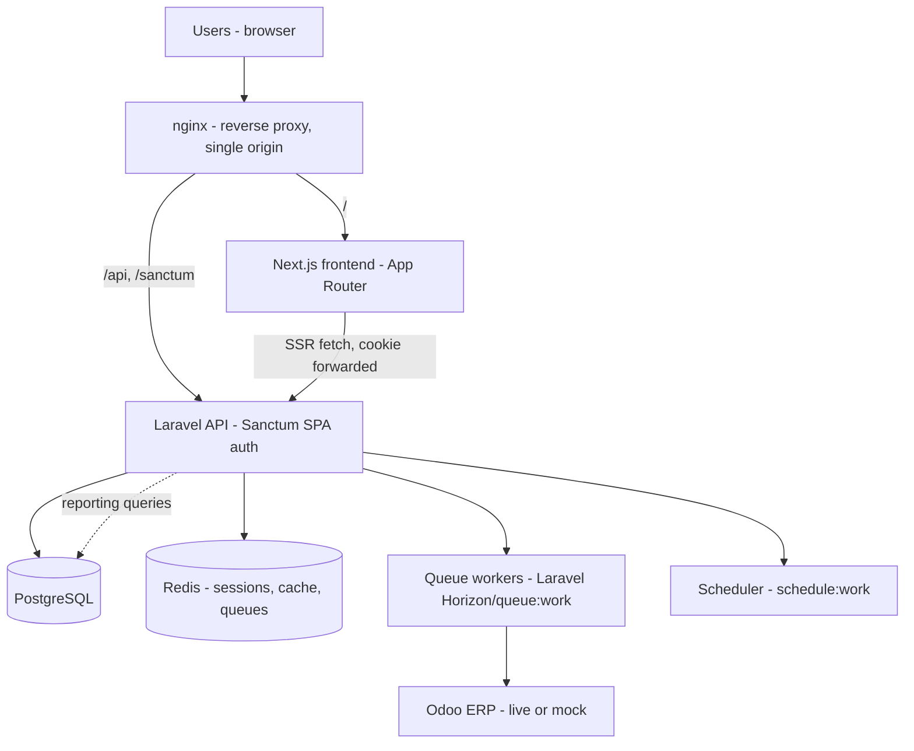

# ImpactFlow — Architecture

## 1. System overview



`nginx` is the single entry point in both local Docker and any future deployment: `/` routes to Next.js, `/api` and `/sanctum` route to Laravel. This keeps the frontend and API on one registrable origin, which is what makes Sanctum's cookie-based SPA auth work without CORS/SameSite workarounds (see §3).

## 2. Backend structure

Laravel 12, PHP 8.3, service-oriented — business logic lives in `Actions`/`Services`, not controllers.

```text
backend/
├── app/
│   ├── Actions/          # single-purpose use-case classes (LoginAction, ApproveExpenseAction, ...)
│   ├── Console/          # scheduled commands
│   ├── DTOs/             # typed data transfer objects for cross-layer boundaries
│   ├── Enums/            # RoleEnum, ProgramStatus, ExpenseStatus, ... (PHP 8.3 backed enums)
│   ├── Events/           # domain events (ExpenseApproved, BeneficiaryRegistered, ...)
│   ├── Exceptions/
│   ├── Http/
│   │   ├── Controllers/Api/V1/
│   │   ├── Requests/     # FormRequest validation
│   │   └── Resources/    # API Resources -> {data, meta} envelope
│   ├── Jobs/             # queued work (Odoo sync, imports, report generation, emails)
│   ├── Listeners/
│   ├── Mail/
│   ├── Models/
│   ├── Notifications/    # WorkflowActionNeeded, WorkflowDecisionRecorded, ProgramAwaitingApproval, OdooSyncFailed
│   ├── Policies/         # authorization, one per model, enforced via Gate/Policy
│   ├── Services/
│   │   ├── Odoo/         # OdooClient, OdooAuthService, OdooSyncService, OdooMappingService, OdooHealthService
│   │   ├── Workflow/      # generic approval-workflow engine
│   │   ├── Reporting/
│   │   ├── DataQuality/
│   │   └── Import/
│   └── Support/          # ApiResponse and other cross-cutting helpers
├── database/
│   ├── migrations/
│   ├── seeders/
│   └── factories/
├── routes/
│   ├── api.php           # /api/v1/*
│   ├── console.php       # scheduled commands (e.g. odoo:poll)
│   └── web.php           # Sanctum CSRF cookie route only
└── tests/
    ├── Feature/
    └── Unit/
```

**Scaffolding policy:** a directory above is only populated with real code when a phase genuinely needs it. `Repositories/` is intentionally absent — generic Eloquent CRUD repositories are an anti-pattern here; the one real gateway abstraction the project needs is `Services/Odoo/OdooClient`, which already has a home. `Policies/`, `Events/Listeners` gain their first files in Phase 2 (RBAC) and Phase 4 (workflow engine) respectively — not stubbed empty in Phase 1. `Services/DataQuality/`, `Services/Import/`, and `Jobs/Import/` are populated as of Phase 5 (duplicate detection, the spreadsheet reader, and the queued commit job). `Mail/`/`Notifications/` are populated as of Phase 8. **`Livewire/` never materialized** — an earlier plan (this section, written in Phase 0) anticipated it for "selected internal/admin workflows... e.g. the Odoo config screen," but when Phase 7 actually built that screen, a plain Next.js page (`frontend/src/app/(dashboard)/odoo/`) fit the rest of the app's established pattern better than introducing a second server-rendered UI stack for one screen; `livewire/livewire` was never added to `composer.json`. Every admin-only screen in this app (Roles & Permissions, Audit Logs, Odoo Integration) is a permission-gated Next.js page, not a Livewire component. `docker/nginx/default.conf`'s routing had the same stale `/livewire` path left over from that original plan (routed to Laravel alongside `/api`/`/sanctum`) — removed in Phase 9's hardening pass alongside the other confirmed gaps found there (see `docs/implementation-plan.md` Phase 9).

## 3. Authentication & session architecture

- **Mechanism:** Laravel Sanctum SPA (stateful, cookie-based) authentication, serving the Next.js SPA only — there is no separate Livewire auth path to keep in sync (see §2's scaffolding note: Livewire was never adopted).
- **Flow:** Next.js calls `GET /sanctum/csrf-cookie` once, then `POST /api/v1/login` with credentials; Laravel sets an encrypted, HttpOnly session cookie (`SESSION_DRIVER=redis`). Subsequent requests carry the cookie automatically (same origin via nginx) and an `X-XSRF-TOKEN` header read from the non-HttpOnly `XSRF-TOKEN` cookie for CSRF protection.
- **Server-side rendering gotcha:** Next.js Server Components/Route Handlers do not automatically forward the browser's cookies when calling Laravel. `frontend/src/lib/auth/session.ts` exports `getServerAuth()`, the single seam every protected server component uses to read the incoming request's `cookie` header and forward it to `GET /api/v1/user`.
- **Second SSR gotcha (found in Phase 2, easy to reintroduce):** forwarding the cookie header is not enough on its own. Sanctum's `EnsureFrontendRequestsAreStateful` only authenticates a request via the session cookie when its `Referer`/`Origin` matches a configured stateful domain — a plain server-to-server `fetch()` with no such header looks unauthenticated even with a valid session cookie attached, so every "authenticated" page silently redirected back to `/login`. `getServerAuth()` fixes this by forwarding the incoming request's own `Host` header as `Referer` (correct here specifically because nginx is the single origin for both frontend and API — see the CI docker-smoke-test job, which now exercises a real authenticated `/dashboard` request rather than only `/api/health`, precisely to catch this class of bug before it ships again).
- **Future mobile path:** Sanctum's token abilities remain available (not wired into the primary web flow) as a documented option if a mobile client is ever added — no code exists for this in Phase 1, it's a reserved architectural option only.

## 4. Frontend structure

Next.js (App Router), TypeScript, Tailwind, shadcn/ui, TanStack Query.

```text
frontend/src/
├── app/
│   ├── (auth)/login/page.tsx
│   ├── (dashboard)/layout.tsx       # server-side auth gate + shell (sidebar/topbar)
│   └── (dashboard)/dashboard/page.tsx
├── components/
│   ├── ui/            # shadcn-generated primitives
│   └── layout/         # sidebar, topbar, nav
├── lib/
│   ├── api/
│   │   ├── client.ts   # fetch wrapper: credentials 'include', CSRF bootstrap, X-XSRF-TOKEN header
│   │   ├── errors.ts   # ApiError{status, message, fieldErrors} normalized from Laravel's 422 shape
│   │   └── endpoints/   # auth.ts now; programs.ts, beneficiaries.ts, ... added per later phase
│   ├── auth/session.ts # getServerAuth()
│   └── query-client.ts  # QueryClient + RSC hydration boundary setup
├── middleware.ts        # cheap cookie-presence redirect for protected route matcher
└── types/
```

Two-layer route protection: `middleware.ts` does a cheap cookie-presence check (fast, no network call); the `(dashboard)/layout.tsx` server component does the authoritative check via `getServerAuth()` and will carry role/permission data for permission-driven nav once Phase 2 lands. This seam is built once, in Phase 1, so every later module inherits it.

## 5. Docker topology

`docker-compose.yml` defines the full stack from day 1 (not deferred to phase-end), so infra drift is caught early:

| Service | Role |
|---|---|
| `nginx` | single entry point, path-based reverse proxy |
| `laravel` | php-fpm running the Laravel app |
| `nextjs` | Next.js app (standalone output) |
| `postgres` | primary datastore |
| `redis` | sessions, cache, queue driver |
| `worker` | `php artisan queue:work` — Odoo sync, imports, report generation, emails (populated as those jobs are built) |
| `scheduler` | `php artisan schedule:work` — nightly data-quality scan, Odoo sync, reminders (populated in later phases) |

For local development, PHP/Composer are also installed on the host (via Homebrew) purely for fast `artisan`/test iteration; the host CLI points at the same containerized Postgres/Redis (ports exposed to `127.0.0.1`) rather than running a second, drifting `artisan serve` HTTP server. Every change is still validated against the full `docker compose up` stack before a phase is considered done.

## 6. Cross-cutting conventions

- **API responses:** every endpoint returns `{"data": ..., "meta": {...}}` on success (see `docs/api-design.md`) via `App\Support\ApiResponse` and Laravel API Resources; validation failures return Laravel's standard `{"message": ..., "errors": {...}}` 422 shape. The frontend's `lib/api/errors.ts` normalizes both into one `ApiError` type — built once, reused by every module.
- **Authorization:** enforced server-side via Policies/Gates (Phase 2 onward) — never trust frontend route hiding alone. A dedicated Policy class is written only when a resource needs authorization logic beyond a flat permission check (e.g. `UserPolicy`'s self-deactivation guard). Pure permission-gated CRUD (Departments, Branches, Program Categories, and most of Programs/Beneficiaries/Employees/Volunteers/Activities in Phase 3) authorizes directly via `Gate::authorize('resource.permission')` with no Policy class at all — `spatie/laravel-permission` registers its own `Gate::before` hook that resolves an ability name directly against `hasPermissionTo()` when the ability string *is* the permission name, so a Policy method that only ever does `return $user->can($permission)` would be pure boilerplate.
- **Audit logging:** a single `AuditLog` model, written only via `App\Services\Audit\AuditLogger` (wired in Phase 2). Called explicitly from `Actions` rather than via a generic model-observer — the product brief's own audit examples ("Changed user role", "Approved program") are business actions, not raw CRUD diffs, and a generic before/after diff on every `updated` event would just say "updated" where the audit trail needs to say *why*. Every sensitive mutation from Phase 2 onward calls it from the Action that performs it.
- **Odoo integration:** isolated entirely behind `Services/Odoo/*`; no other part of the app talks to Odoo's API directly. See `docs/odoo-integration.md`.
